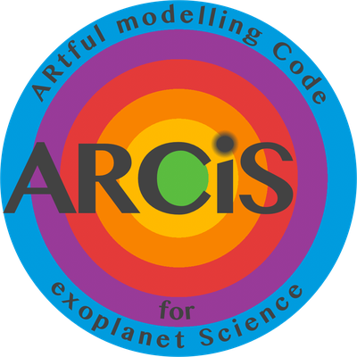

# ARCiS

{ width="220" }

**ARCiS** — the *ARtful modelling Code for exoplanet Science* — is a framework for
modelling and retrieving exoplanet atmospheres. It combines a fast radiative transfer
code with physically motivated models for the chemistry, the temperature structure and
cloud formation, wrapped in a Bayesian retrieval framework. ARCiS is written in Fortran
and has an optional Python interface.

The modelling philosophy is described in [Min et al. (2020)](citing.md): rather than
fitting free abundances only, ARCiS can retrieve the *physical* parameters that set the
atmosphere (metallicity, C/O, irradiation, mixing, nucleation rates, …) and compute the
composition, temperature and clouds consistently from those.

## What ARCiS can do

-   **Forward models**

    Transmission, emission and reflected-light spectra and phase curves, from 1D
    atmospheres or pseudo-3D (β-map) planets.

-   **Chemistry**

    Free abundances, equilibrium chemistry with GGchem, disequilibrium chemistry from
    vertical mixing, and a parameterised photochemistry scheme.

-   **Temperature structure**

    Power-law and parameterised (Guillot) profiles, free profiles for retrievals, or a
    self-consistent radiative–convective temperature structure.

-   **Clouds**

    Self-consistent cloud formation with diffusion, sedimentation and coagulation, or
    parameterised cloud layers, decks and hazes with optical properties from
    refractive indices (Mie, DHS).

-   **Retrievals**

    MultiNest nested sampling, MCMC and optimal estimation, with correlated noise
    models, multiple data sets and Gaussian-process surface albedo retrievals.

-   **Python interface**

    Initialise ARCiS from Python, change keywords and compute spectra in a loop, or
    drive your own sampler with the ARCiS forward model.

## Where to start

* New users: follow [Installation](getting-started/installation.md) and the
  [Quick start](getting-started/quickstart.md).
* Writing an input file: read [Input files](user-guide/input-files.md) and look up
  options in the [Keyword reference](reference/keywords.md).
* Running a retrieval: see [Retrievals](user-guide/retrieval.md).

## Terms of use

By using ARCiS you agree to:

* consult with the developers if there is any doubt about the results before
  publication (contact: [M.Min@sron.nl](mailto:M.Min@sron.nl));
* cite the appropriate papers listed under [Citing ARCiS](citing.md).

ARCiS is a complex code that can do a lot of things, which also means things can go
wrong. These terms are there to make sure ARCiS is used correctly and that the results
are scientifically useful.
